# Using S3 with CloudFront to host Static Websites for FREE\*


The best option for sites that only contain static content.

\*charges may apply when you have too much traffic to your website. refer to the pricing of S3 and Cloudfront.

[↩️ go back](../)

## Introductions

There are many ways to host your next website. WordPress, Docker, EC2, and many more. However, if you are an enthusiast like me, chances are you only have HTML, CSS, and maybe some client-side JS for that bling.

In that case, why waste all those resources just to serve some texts over the internet? That's where s3 comes in. Simple Storage Service. A storage service that is simple yet powerful. The best part is, it's free!!!

This is a step by step walkthrough on hosting you website using S3. We will be configuring S3, Route 53, CloudFront, ACM. This solution should be free minus the Route 53.

If you don't have a site, I have a [s3_static_site.zip](contents/s3_static_site.zip) in my repo, use it for fun.

## Table of contents

- [Using S3 with CloudFront to host Static Websites for FREE\*](#using-s3-with-cloudfront-to-host-static-websites-for-free)
  - [Introductions](#introductions)
  - [Table of contents](#table-of-contents)
  - [Step 1: AWS Account](#step-1-aws-account)
  - [Step 2: Create S3 bucket](#step-2-create-s3-bucket)
  - [Step 3: Upload content](#step-3-upload-content)
  - [Step 4: Enable website hosting](#step-4-enable-website-hosting)
  - [Step 5: Configuring domain](#step-5-configuring-domain)
  - [Congruation: Your website is now up](#congruation-your-website-is-now-up)
  - [Step 6: Create CloudFront distribution](#step-6-create-cloudfront-distribution)
  - [Step 7: Obtaining a TLS certificate](#step-7-obtaining-a-tls-certificate)
  - [Step 8: Setting up CNAME for distribution](#step-8-setting-up-cname-for-distribution)
  - [Step 9: HTTP to HTTPS redirect](#step-9-http-to-https-redirect)
  - [Step 10: Celebrate](#step-10-celebrate)

## Step 1: AWS Account

Register an account, chances are if you are just a regular user, you won't have an AWS account to do this, this is where I won't be to help, it is not complicated to register one. The problem lies in the fact that it is dangerous. Check out this post from Cyrus Wong to see why and how.

[How to use AWS for free? (Tips for teaching AWS in College.) `|` LinkedIn](https://www.linkedin.com/pulse/how-use-aws-free-tips-teaching-college-wong-chun-yin-cyrus-%25E9%25BB%2583%25E4%25BF%258A%25E5%25BD%25A5-/)

Once complete feel comfortable to continue. Feel free to follow along.

<span style="color:#FF4C4D">Disclaimer!! This is for educational and demonstrational purposes only. I am not responsable for any loss. Please know what you are doing, continue at your own risk.<br />DO NOT USE THE ROOT ACCOUNT!!!<br />DO NOT USE THE ROOT ACCOUNT!!!<br />DO NOT USE THE ROOT ACCOUNT!!!</span>

## Step 2: Create S3 bucket

Before we can have our website, we need a place to store the content.

1. Search for `S3` on the search bar in the management console. Click the first one that pops up.

   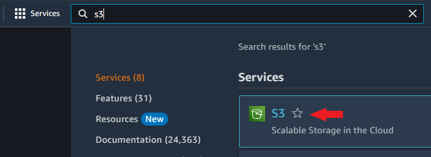

2. Now we need to create a bucket to store our website's content. Go ahead and create a bucket.
  
   

3. we are going to specify some options for our bucket.

   - For the bucket name, use your website domain name, for me, it's `karlcch.com`
   - The closest region to you should be selected.

   

## Step 3: Upload content

After creating out bucket, upload the content into the bucket

1. Select the bucket you just created

   

2. Click on upload

   - we need 2 important files `index.html` and `error.html`
   - it can be renamed to whatever.
   - we will define the entry point for our website in Step 3

   

3. click on add files and select all website content including folders.

   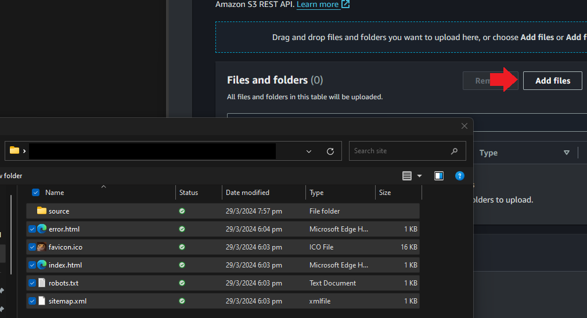

   Once that's done click close at the close button at the top right corner

   

## Step 4: Enable website hosting

After we upload the content of our website into the s3 bucket, we need to enable the hosting feature in s3 and permit everyone to visit our website

1. click the property tab

   

2. scroll down until you see `Static website hosting`

   

3. click `enable`

   

4. Specify the home page(index document) and error page(error document) of your website.

   

5. Click `Save Changes` at the bottom. You will now see a link in the `Static website hosting` section.

   

   However, the website cannot be accessed.

   

   We need to specify some permission to allow everyone to view our website.

6. To allow everyone to access our website. Navigate to the permission tab.

   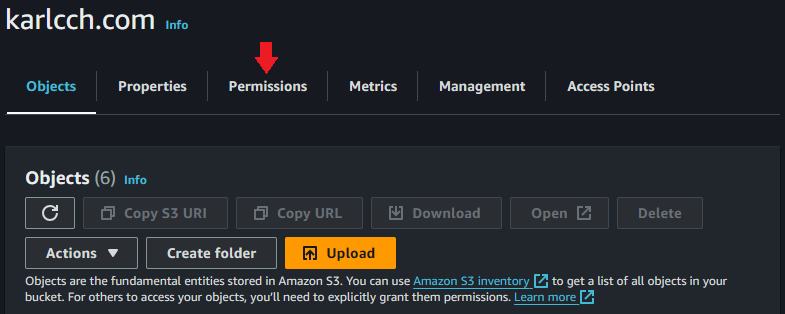

7. scroll to `Block public access (bucket settings)` and click edit.

   

8. uncheck `Block all public access` and click `Save changes`.

   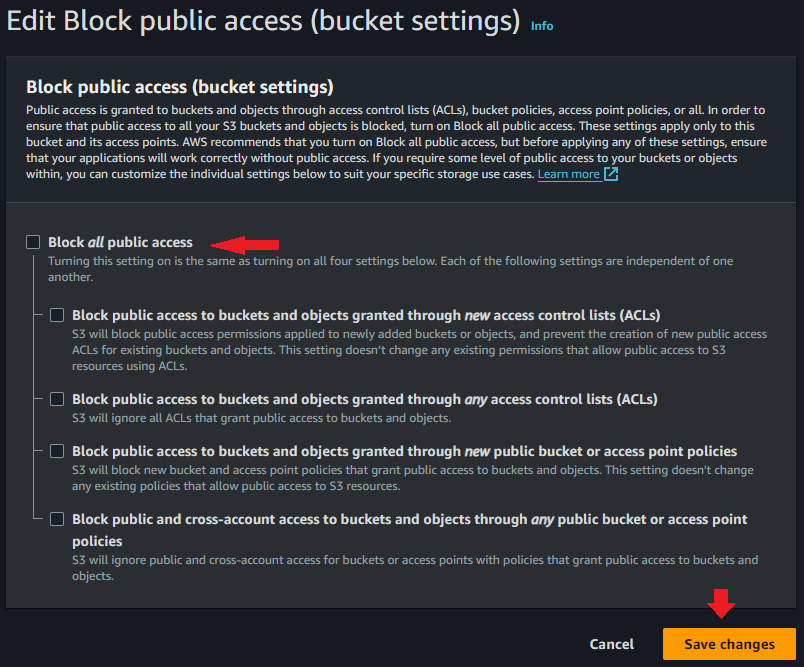

   A prompt will pop up asking you to type in confirm.

   <span style="color:#FF4C4D">Make sure there is no non-public content.<br /> Make sure there is no non-public content.<br /> Make sure there is no non-public content.</span>

   Type in confirm and click confirm.

   <span style="color:#FF4C4D">Make sure there is no non-public content.<br />Make sure there is no non-public content.<br />Make sure there is no non-public content.</span>

   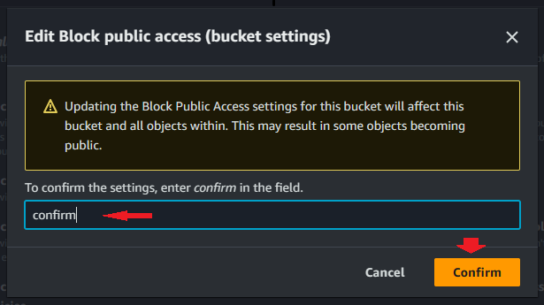

9. However our website is still not accessible as we haven't specified permit on anything.

   

   Navigate to `Bucket policy` and click `Edit`

   

10. paste the following JSON into the `Policy` field

    ```json
    {
      "Version": "2012-10-17",
      "Statement": [
         {
            "Sid": "Public Access",
            "Principal": "*",
            "Effect": "Allow",
            "Action": [
               "s3:GetObject"
            ],
            "Resource": "<- Your Bucket ARN ->/*"
         }
      ]
    }
    ```

    replace `<- Your Bucket ARN ->` with your bucket arn found above the `Policy` field.

    - `"Sid"`: Name for the Statment
    - `"Principal"`: specify what this statement applies to.
    - we have `"*"` specified, which permits everything
    - `"Effect"`: Allow or Deny
    - `"Action"`: Action applied on the resources this statement applies to
    - in this case, we permit the `"Principal"` to use the `"s3:GetObject"` in `"Resource"`.
    - "Resource": Resources that utilize this statement
      - in this case our bucket.

      - the `/*` at the end means everything. which is all objects in the bucket.

      - <span style="color:#FF4C4D">Make sure there is no non-public content.<br />Make sure there is no non-public content.<br />Make sure there is no non-public content.</span>

    - visit [https://docs.aws.amazon.com/AmazonS3/latest/userguide/example-bucket-policies.html](https://docs.aws.amazon.com/AmazonS3/latest/userguide/example-bucket-policies.html) for more examples and documentation of bucket policy.

    

    Click `Save changes` at the bottom

    <span style="color:#FF4C4D">Make sure there is no non-public content.<br />Make sure there is no non-public content<br />Make sure there is no non-public content.</span>

    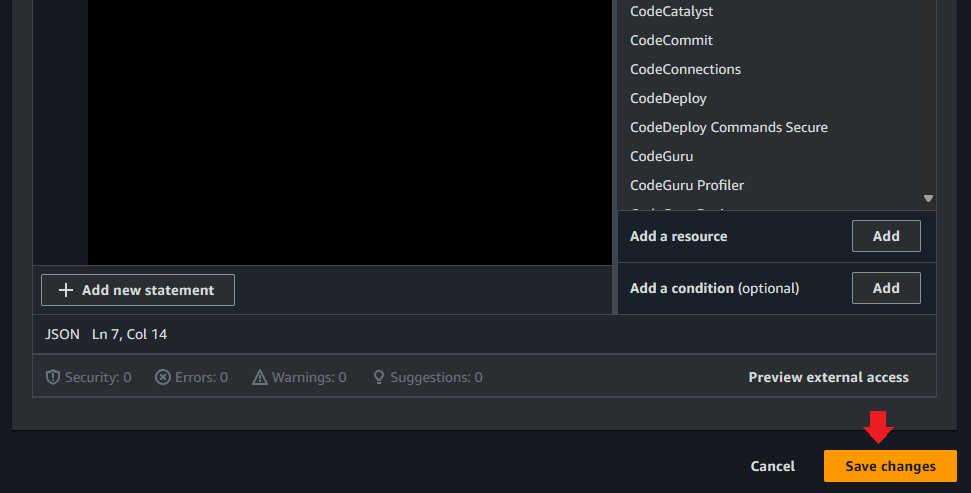

    Once the is complete. Go back to `Static website hosting` and click on the link. The website should now be up and running.

    

## Step 5: Configuring domain

Now that we have our website running we need to have our domain associated with the s3 bucket. To do that go to your dns provider and add a [CNAME](https://www.cloudflare.com/en-gb/learning/dns/dns-records/dns-cname-record/) record to your domain. In my case I have [Router 53](https://aws.amazon.com/route53/) as my dns provider.

Refer to [AWS documentation on settng up Hosted Zone](https://aws.amazon.com/getting-started/hands-on/get-a-domain/#:~:text=Enter%20Route%2053%20in%20the%20search%20bar%20and,for%20you%20as%20part%20of%20the%20domain%20registration.) Note, as of writing, 1 hosted zone is US $0.5. refer to [AWS Route 53 pricing documentation](https://aws.amazon.com/route53/pricing/).

1. Look for Route 53 console

   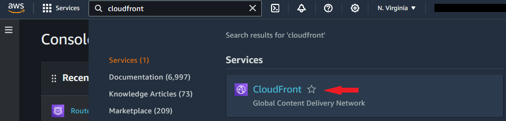

2. Select Your domain

   

3. Click `Create Record`

   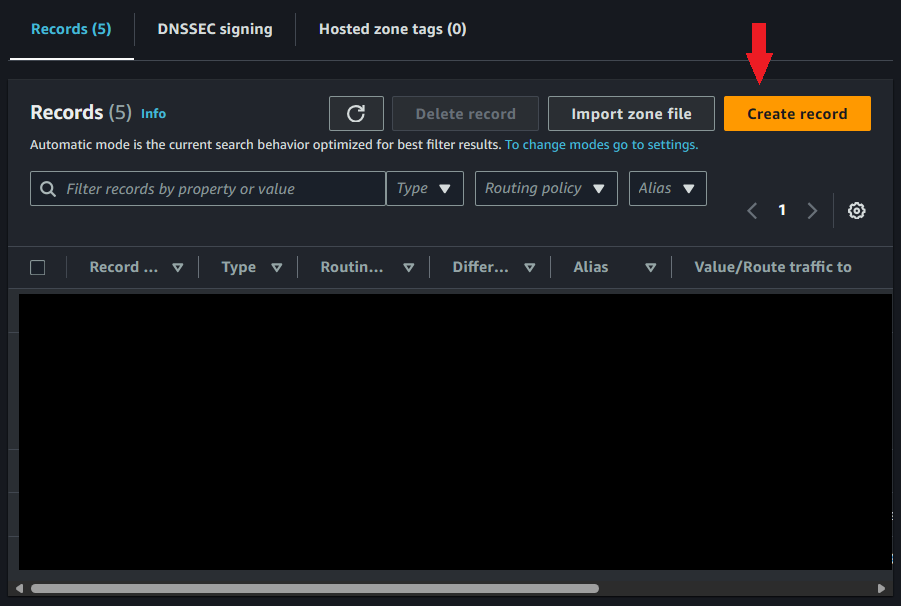

4. Create a record for our domain

    1. Leave the subdomain blank to use the root domain.
    2. In the first `Route traffic to` box, select `Alias to S3 website endpoint`
    3. In second field select the region of your S3 bucket
    4. Select the website endpoint for your bucket. If first and second field are correct it should appear automatically when you click on it.
    5. click `Create records`

    (images/Step4.4.png)![Add Records]

5. Test your website

   

## Congruation: Your website is now up

You can stop here, you now have a website hosted on aws for free\*.

## Step 6: Create CloudFront distribution

CloudFront is a CDN service, it caches your service to edge locations so visitors fron other regions will access their nearest edge location instead of your bucket in whatever region. Refer to documentation, [https://aws.amazon.com/cloudfront/](https://aws.amazon.com/cloudfront/).

1. Go to CloudFront console

   

2. click the `distribution` tab and click `Create distribution`

   

3. Fill in the Information

   1. in the Origin Section, click the origin box and select the one with you s3 bucket name. The rest will be filled in for you. You can change the name to whatever you want.

      

   2. in the [`Web Application Firewall (WAF)`](https://docs.aws.amazon.com/waf/latest/developerguide/cloudfront-features.html) section select `Do not enable security protections`

      

   3. Create the Distribution

      

4. Test your CDN

   1. In the details of your newly created distribution, you should see a distribution link

      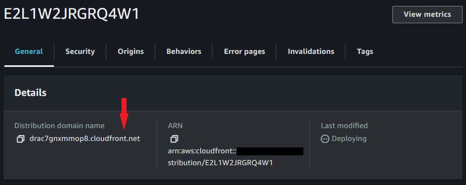

   2. Copy it can open it with your broswer

      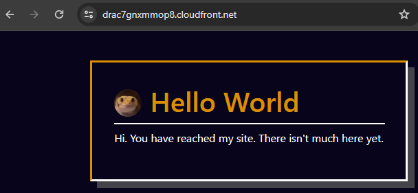

5. You now have a CDN linked to your website

## Step 7: Obtaining a TLS certificate

In this step we will setup ACM to obtain a certificate for our domain.

1. Go to ACM console, make sure you are in the us-east-1(US East (N. Virginia)) region. CloudFront only support certificate in the us-east-1 region.

   

2. Click `Request certificate` and click `Next`

   

3. In the `Domain Name` section, input your domain to the domain field

   

4. Chose varification methoad

   - DNS, using cname
   - Email, an email will be sent to you with the instruction, no additional dns record are needed

   Reommend using the DNS method. After that click `Request`.

   

5. Click the certificate with your domain.

   

6. Create the DNS record in your dns provider

   - because I am using Route 53, I can just click the `Create records in Route 53`
   - if you are not using Router 53, you will need to manually create the records or export to CSV and import it into your DNS host

   

7. For me I still have to complete more steps. Skip if you have completed record creation

   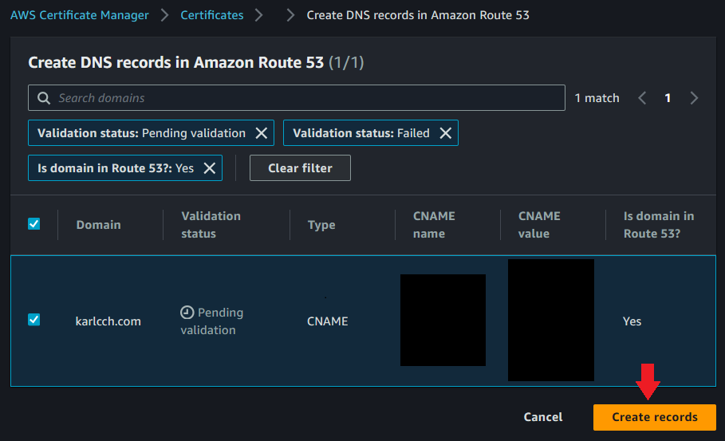

8. It takes a while for AWS to verify your domain

   

   once complete the this should says `Issued` with a green tick, see below.

   

## Step 8: Setting up CNAME for distribution

We can now use the certificate we just obtained to enable https on our distribution with our domain name

1. Go back to the `CloudFront` console and click on your distribution. You can identify your distribution based on the origion

2. In the `Setting` section, click `Edit`

   

3. Select domain and certificate

   1. In the `Alternate domain name (CNAME) - optional` tab, click `Add item` and input your domain
   2. In the `Custom SSL certificate - optional` section, select the certificate we requested.

   

4. Leave the other settings as default and click `Save changes`.

   

5. Change DNS records.

   - This is going to be different if you are not using route 53.
   - For other DNS provider, change the record to CNAME to the distribution domain name and you can skip this step

   1. go to route 53 console

   2. select your domain

   3. select the record we created before and click `Edit record`

      - if you didn't follow the create record step above, create one

      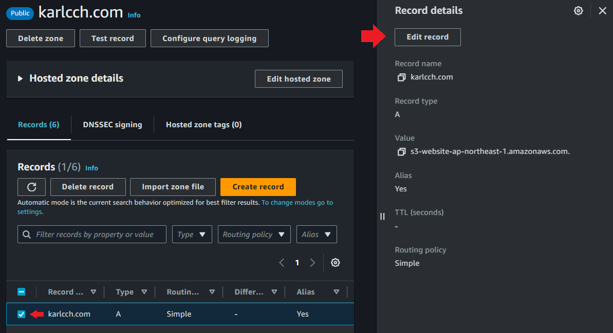

   4. Select the CloudFront distribution to route to

      1. the first field, selct `Alias to CloudFront distribution`
      2. the second field, select the distribution you created
      3. click save

      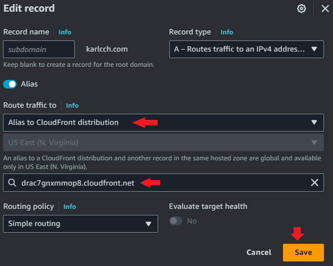

6. Your site is now up and routed through CloudFont along with a certificate.

   

## Step 9: HTTP to HTTPS redirect

This setp is optional, we will setup error pages, and redirect http to https.

1. change patern

   1. Navgate to the `Behaviors` tab of your distribution
   2. Select the one with a path pattern of `Default (*)`
   3. click `Edit`

   

2. In the `Viewer` section of `Settings`

   - Select `Redirect HTTP to HTTPS`

   

   - Save Changes

   

3. Test your changes

   - Your website should now automatically redirect to HTTPs when HTTP are recieved

## Step 10: Celebrate

You have now sucessfully hosted a website on aws for free\*
