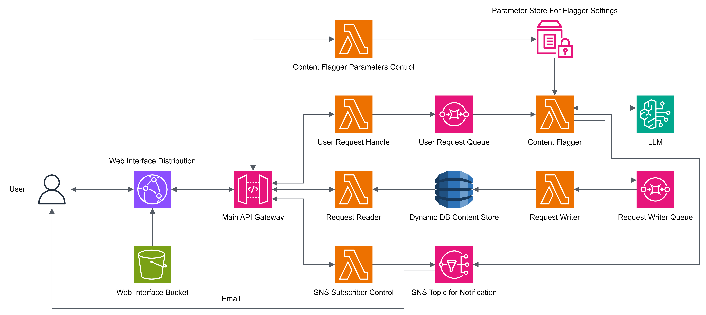

# Exploring CloudFront, Lambda, APIGW, SQS, SNS and ReactJS

This post is about playing with sqs, sns, apigw, lambda, cloudfront, and reactjs. The starter pack for any small project that involves cloud.

[↩️ go back](../)

## Table of contents

- [Exploring CloudFront, Lambda, APIGW, SQS, SNS and ReactJS](#exploring-cloudfront-lambda-apigw-sqs-sns-and-reactjs)
  - [Table of contents](#table-of-contents)
  - [background](#background)
    - [The problem](#the-problem)
    - [What happened](#what-happened)
  - [Design](#design)
  - [S3 + ReactJS is great](#s3--reactjs-is-great)
    - [What is ReactJS](#what-is-reactjs)
    - [React offerings](#react-offerings)
    - [S3 is perfect](#s3-is-perfect)
  - [APIGW + Lambda Function = Perfect Backend API](#apigw--lambda-function--perfect-backend-api)
    - [The client is powerful](#the-client-is-powerful)
    - [JS is not secure](#js-is-not-secure)
    - [Abstraction](#abstraction)
    - [Serverless](#serverless)
    - [Working With API Gateway + Lambda](#working-with-api-gateway--lambda)
  - [Cloufront is not just a CDN](#cloufront-is-not-just-a-cdn)
    - [Content Delivery Network](#content-delivery-network)
    - [CloudFront as HTTP rewrite](#cloudfront-as-http-rewrite)
    - [CloudFront as Path Router](#cloudfront-as-path-router)
    - [Working with CloudFront](#working-with-cloudfront)
      - [Using Cloudfront + S3 to host ReactJS website](#using-cloudfront--s3-to-host-reactjs-website)
      - [Using Cloudfront as a Path Router](#using-cloudfront-as-a-path-router)

## background

When I was studying for the AWS-SAA exam I came across [`decoupling`](https://docs.aws.amazon.com/prescriptive-guidance/latest/modernization-integrating-microservices/decouple-messaging.html) a lot.

From a monolith ec2 instance to s3 for static content and lambda function to handle requests. If a lambda function handles too many tasks or takes too long to complete or may not be able to complete, we decouple it with SQS. I know why and when to use SQS, but in practice, how does it actually work? I've wanted to play with it for a while now, but I haven't been able to find a use case for myself.

### The problem

Last month, one of my friends from high school dragged me to chat with his friends to talk about an idea his classmate had. The project is an online platform that allows its users to post something, someone's response and something something, not going into details, but one of the problems we encountered is platform moderation. We want to allow users to post content(mostly text) freely, and we also want to not monitor the platform 24/7.

That's when I had an idea to use AI to screen the content before it was published. The idea is to have an LLM look at the content submitted and mark it as safe and not safe based on a set of rules, if a submission is flagged the site will send an email to moderators to manually verify the content.

### What happened

The idea is great and the project lead thinks it's great as well. The only problem is that the 2 people leading the project didn't prepare anything and probably didn't know what they were doing. When we pointed out a list of concerns and problems that didn't cross their mind, the project was scrapped in the end.

But the idea of a content screener is not dead and I now have an excuse to use sqs, sns, apigw, and lambda functions to solve a problem that doesn't exist.

## Design

Github repo: [ltekme/AI-Screener-For-User-Generated-Content](https://github.com/ltekme/AI-Screener-For-User-Generated-Content)

This is an illustration of how it is hosted on AWS. Because I wanted to make it work on both a normal account and AWS Acaedmy Learn Lab account, this diagram is different from the one hosted on AWS Acaedemy Learner Lab.

Some of the things are not included when deploying on Learner Lab, namely Bedrock, and CloudFront. I can understand bedrock, but CloudFront as well??? I can spend another couple of days migrating the AI part to Google Vertex AI so it can still flag content, but I figured, no.

This project isn't some super complicated money making idea or something, just an excuse to play with things and share what I learned and went through.

## S3 + ReactJS is great

### What is ReactJS

[ReactJS](https://react.dev/) is a javascript library for building user interfaces developed by Facebook and is widely used by developers to create dynamic web interfaces. To learn more, check out: [https://react.dev/learn](https://react.dev/learn)

### React offerings

React offers both `server-side rendering` and `client-side rendering`. In short `server-side rendering` is when the server constructs the HTML and sends it to the client browser to render the page.

`client-side rendering` is the opposite of `server-side rendering`. It renders the web page after it has arrived at the browser. The browser executes reactjs. Reactjs adds and changes elements on the client to render the page. The page rendering process is done on the client instead of the server.

Read more: [React.js: Server-Side Rendering vs Client-Side Rendering](https://flatirons.com/blog/react-js-server-side-rendering-vs-client-side-rendering/#:~:text=Key%20Takeaways%3A-,React.,using%20JavaScript%20for%20dynamic%20updates.)

Its flexibility allows developers to quickly spin up an idea without too much hassle. Not to mention its brothers like [vuejs](https://vuejs.org/), and [nextjs](https://nextjs.org/). Almost anything that comes to mind on a browser window can be built using it. It is just JavaScript. Being popular among developers, it is widely adopted by hosting providers like [Vercel](https://vercel.com/). It can even be run on [GitHub pages](https://pages.github.com/). Both of which is free* to a certain extent.

### S3 is perfect

With the above, reactjs only need the clients to do the rendering, we only need to serve the HTML to the browser. It is screaming "Host it on s3".

To put it simply. S3 is a hard disk plugged into the internet, allowing users to store and access their data as long as there is an internet connection. One of its features is [static website hosting](https://docs.aws.amazon.com/AmazonS3/latest/userguide/WebsiteHosting.html). I made a post on how you can use s3 and CloudFront to host your website globally for almost free* [here](../1.Using-S3-to-host-static-website/README.md).

## APIGW + Lambda Function = Perfect Backend API

One of aws best combination is [APIGW](https://aws.amazon.com/api-gateway/) with [Lambda function](https://aws.amazon.com/lambda/) integration. There is your programming API and there is HTTP API.

I wrote a simplified version of what is API [here pages/What-Is-API/README.md](pages/What-Is-API/README.md).

### The client is powerful

In the above we covered ReactJs. A library to create the front end. Only one issue. How do we interact with data. If we are already rendering the page on the client, why not just do it all on the client. You can, but it's a terrible idea.

To access AWS services, we need an authentication token to identify who you are and whether you are allowed to use the service you are trying to access. You can use [AWS Cognito](https://aws.amazon.com/cognito/) to authenticate your client, but that comes with a whole set of other problems.

### JS is not secure

Anyone who has messed with the developer console would know. Once the content is in the hands of the client. There is no guarantee what is being done to any of the content. The JavaScript contents of a page can easily be modified. Do you really want to allow something you don't know to do touching your data directly. No. There is only one answer. No

### Abstraction

With that said. One of the best ways to make sure something you don't know won't mess up your data is abstraction.

By masking the code that interacts with your data with a URL, you can make sure what's being done to your backend is traceable and expected. Instead of having your raw data exposed to the client, you can first transform it and then send it to the client.

When the client wants to send some data to the server. Instead of directly writing to the database, hand the data to the API to make sure it is valid and not something that will destroy your data. You especially don't want to give the client to delete data directly. It should go through a request to the API.

### Serverless

Computers are wasteful. You provision a set amount of compute, it is assigned to you, but are you using it. Chances are small projects like this, are not going to get any real users, even so, 10 or 20 querying a server a couple of times a day is not worth the cost of running the compute instance. Worse yet the API barely gets any requests, you are paying for something you don't use.

That's when serverless comes in. You define what you need to run and it only runs when it is triggered. Setup your code and specify your runtime, and the underlying os takes care of the processing for you, instead of reserving a set amount of compute, you share a pool of resources among thousands, even millions of other AWS customers. You are only billed for what you use, how much your code takes up RAM and how long it takes to run is how much you are billed.

### Working With API Gateway + Lambda

Please read [pages/Working-With-APIGW-and-Lambda/README.md](pages/Working-With-APIGW-and-Lambda/README.md). It details how API Gateway can be used with Lambda to create a public API.

## Cloufront is not just a CDN

Even though [CloudFront](https://aws.amazon.com/cloudfront/) on paper sounds like CDN, like Amazon, it is way more than just a CDN.

### Content Delivery Network

CDN is copies of the same thing hosted by lots of smaller servers placed around the world as a cache. So you don't need to query a server in the US from HK, instead, you are accessing a copy of the same content cache nearest you. Read more: [https://aws.amazon.com/what-is/cdn/](https://aws.amazon.com/what-is/cdn/), [https://en.wikipedia.org/wiki/Content_delivery_network](https://en.wikipedia.org/wiki/Content_delivery_network)

### CloudFront as HTTP rewrite

One of the features of CloudFront is [custom error response](https://docs.aws.amazon.com/AmazonCloudFront/latest/DeveloperGuide/custom-error-pages-procedure.html).

In the above, using s3 to host reactjs has its perks, most noticeably 404/403 response. Because reactjs only runs with 1 HTML file and the path is consumed and processed by reactjs on the client, the client browser will query the server for a path that may not exist in the s3 bucket. In s3 you can serve the same HTML for [error document](https://docs.aws.amazon.com/AmazonS3/latest/userguide/CustomErrorDocSupport.html#custom-error-document), but there is no change on the status code, 404 will be 404.

We can get around that by using CloudFront's custom error response. We just need to rewrite 4xx error codes to 200 and serve the index.html, and every path will return 200. Note that reactjs can work even with 404 and 403 responses. The issue is different browsers react to these status codes differently, some may not show the error document at all. By rewriting to 200, we can guarantee the browser will take the non-existent path as well.

### CloudFront as Path Router

Another feature of CloudFront is path routing. With how CloudFront features are offered, we can use CloudFront to route traffic based on the URL path.

A CloudFront [origin](https://docs.aws.amazon.com/cloudfront/latest/APIReference/API_Origin.html) defines the location and property of where a piece of content originates.

A CloudFront [cache behavior](https://docs.aws.amazon.com/AmazonCloudFront/latest/DeveloperGuide/distribution-web-values-specify.html#DownloadDistValuesCacheBehavior) defines the behavior of how CloudFront treats an origin. Including path patterns, cached methods, and allowed methods.

Each CloudFront Distribution must contain a default cache behavior to an origin, more than one cache behavior can be defined in a Distribution. From those 2 features, we can set up CloudFront to route our traffic based on the path to a different origin. Similar to [AWS ELB](https://aws.amazon.com/elasticloadbalancing/) or Reverse Proxy Server, but without the multi-target feature.

### Working with CloudFront

#### Using Cloudfront + S3 to host ReactJS website

Please read [pages/Using-CloudFront-and-S3-to-host-ReactJS/RADME.md](pages/Using-CloudFront-and-S3-to-host-ReactJS/RADME.md). It details how S3 and CloudFront can be used together to host website built using React JS

#### Using Cloudfront as a Path Router

Please read [pages/Using-CloudFront-as-a-Path-Router/RADME.md](pages/Using-CloudFront-as-a-Path-Router/RADME.md). It details how CloudFront can be used as a path router, routing different paths to a different origin
