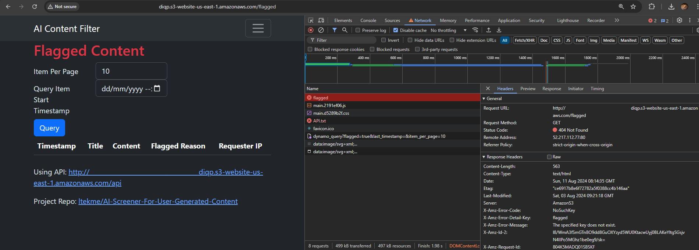
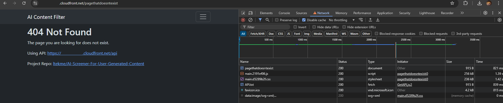
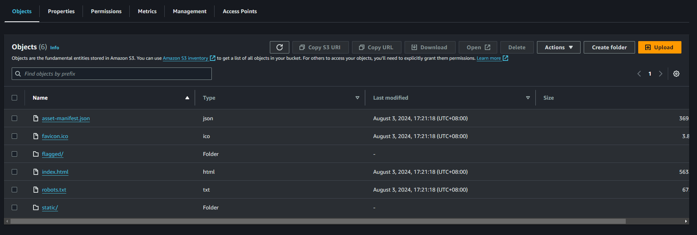
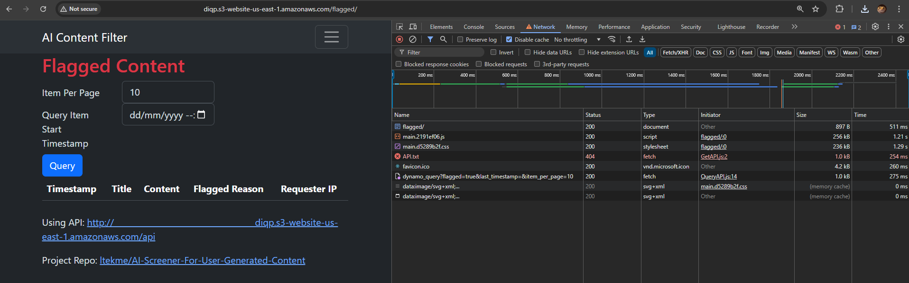

# Using CloudFront and S3 to host ReactJS

This page is about how you can use [CloudFront](https://aws.amazon.com/cloudfront/) and [S3](https://aws.amazon.com/s3/) to host your [React.JS](https://react.dev/) website. Since provisioning everything on the console it doesn't work every time for me and the entire project is provisioned with Terraform. Terrafrom is what's on this page.

[↩️ go back](../../README.md)

## Table of Contents

- [Using CloudFront and S3 to host ReactJS](#using-cloudfront-and-s3-to-host-reactjs)
  - [Table of Contents](#table-of-contents)
  - [React JS Setup and Build](#react-js-setup-and-build)
  - [Setup Terraform Project](#setup-terraform-project)
    - [Terraform requirements](#terraform-requirements)
    - [Terraform AWS provider config](#terraform-aws-provider-config)
    - [Enviroment Variables](#enviroment-variables)
  - [Setup Bucket and Website content](#setup-bucket-and-website-content)
    - [Random String for bucket suffix](#random-string-for-bucket-suffix)
    - [Create bucket](#create-bucket)
    - [Null Resource to provision bucket contents](#null-resource-to-provision-bucket-contents)
      - [Null Resources for Node ReactJS Build (optional)](#null-resources-for-node-reactjs-build-optional)
      - [Null Resources for AWS S3 Sync (optional)](#null-resources-for-aws-s3-sync-optional)
  - [Host with S3 Static website hosting](#host-with-s3-static-website-hosting)
    - [Disable Public Access Block](#disable-public-access-block)
    - [Public Bucket Policy](#public-bucket-policy)
    - [Bucket Static Website Hosting](#bucket-static-website-hosting)
    - [Side-Effect of S3 public Website hosting](#side-effect-of-s3-public-website-hosting)
  - [Host with CloudFront Distribution](#host-with-cloudfront-distribution)
    - [Setup OAC](#setup-oac)
    - [Setup CloudFront Distribution](#setup-cloudfront-distribution)
      - [Create Distribution](#create-distribution)
      - [Setup S3 Bucket Origin](#setup-s3-bucket-origin)
      - [Setup Cache Behavior for s3 origin](#setup-cache-behavior-for-s3-origin)
      - [Setup Custom Error Response](#setup-custom-error-response)
    - [Side-Effects of Custom Error Response](#side-effects-of-custom-error-response)
  - [Getting Around 404 Path Not Exists Error](#getting-around-404-path-not-exists-error)
  - [Each Method Have It's Own Perks](#each-method-have-its-own-perks)

## React JS Setup and Build

Setup nodejs. Here is a guide on how to do so. [https://nodejs.org/en/download/package-manager](https://nodejs.org/en/download/package-manager)

After setting up node js, create a new reactjs app.

1. create a new empty folder and Open a terminal on that folder.
2. run the command `npx create-react-app ./react-website`. This will create a new react app in a new directory `./react-website`
3. run the command `npm run build`

After that, a folder called `build` will be created in the project folder. This folder contains the static content required to host the ReactJS app.

Full Guide: [https://create-react-app.dev/docs/getting-started](https://create-react-app.dev/docs/getting-started)

## Setup Terraform Project

### Terraform requirements

``` hcl
/*########################################################
Terraform Requiements

######################################################## */
terraform {
  required_version = ">= 1.9.1"

  required_providers {
    aws = {
      source  = "hashicorp/aws"
      version = ">= 5.57.0"
    }
    random = {
      source = "hashicorp/random"
      version = ">=3.6.2"
    }
  }
}
```

Defines Terraform and AWS Terraform provider versions

---

### Terraform AWS provider config

```hcl
/*########################################################
AWS Terraform Provider

########################################################*/
provider "aws" {
  default_tags {
    tags = {
      Created_by = "Terraform"
      Project    = var.project-name
    }
  }
  region = var.aws-region
}
data "aws_caller_identity" "current" {}
```

Setup all resources created with AWS provider have tag

- Created_by: Terraform
- Project: \<Project Name>

---

### Enviroment Variables

```hcl
/*########################################################
Terrafrom AWS Project Settings

########################################################*/
variable "project-name" {
  description = "The name of the project"
  type        = string
  default     = "website-on-s3"
}

variable "aws-region" {
  description = "AWS Rrgion code to deploy the resources in"
  type        = string
  default     = "us-east-1"
}
```

## Setup Bucket and Website content

### Random String for bucket suffix

Random string as bucket suffix to prevent duplicate bucket names. Please skip to [AWS Bucket Naming Rule](https://docs.aws.amazon.com/AmazonS3/latest/userguide/bucketnamingrules.html)

```hcl
/*########################################################
Bucket - Suffix

########################################################*/
resource "random_string" "website-bucket-suffix" {
  // random suffix for unique bucket name
  length  = 16
  lower   = true
  upper   = false
  special = false
  numeric = true
}
```

16 charactor long `[A-Za-Z0-9]` string

Reference:

- [https://registry.terraform.io/providers/hashicorp/random/latest/docs/resources/string](https://registry.terraform.io/providers/hashicorp/random/latest/docs/resources/string)

---

### Create bucket

```hcl
/*########################################################
Bucket

########################################################*/
resource "aws_s3_bucket" "website" {
  // Create a S3 bucket for the website hosting
  bucket        = "${replace(replace(var.project-name, "_", "-"), " ", "-")}-${random_string.website-bucket-suffix.result}"
  force_destroy = true
}
```

Replace `_` and `space` with `-` and append bucket suffix. When destroy, destroy the bucket.

Reference:

- [https://registry.terraform.io/providers/hashicorp/aws/latest/docs/resources/s3_bucket](https://registry.terraform.io/providers/hashicorp/aws/latest/docs/resources/s3_bucket)

---

### Null Resource to provision bucket contents

This assumes:

- The react js project is located in the same directory as terraform files.
- The react js project folder is `react-website`.
- The build folder is `react-website/build`.
- [`AWS CLI`](https://aws.amazon.com/cli/) is setup.
- AWS Credentials are accessible by both `Terraform` and `AWS CLI`

Assumed Directory Tree:

```text
.
├── main.tf
├── output.tf
├── variables.tf
└── react-website
    ├── README.md
    ├── build
    ├── package-lock.json
    ├── package.json
    ├── public
    └── src
```

#### Null Resources for Node ReactJS Build (optional)

```hcl
/*########################################################
Bucket - Contents - build

########################################################*/
resource "null_resource" "website-node-build" {
  // Build the web interface from node
  triggers = {
    always_run = "${timestamp()}"
  }

  provisioner "local-exec" {
    working_dir = "${path.module}/react-website"
    command     = "npm install && npm run build"
  }
}
```

#### Null Resources for AWS S3 Sync (optional)

```hcl
/*########################################################
Bucket - Contents - upload

########################################################*/
resource "null_resource" "website-content-sync" {
  // Copy the website folder to the S3 bucket
  provisioner "local-exec" {
    working_dir = "${path.module}/web_interface"
    command     = "aws s3 sync build s3://${aws_s3_bucket.website.id} --delete --region ${var.aws-region}"
  }

  // trigger replace
  lifecycle {
    replace_triggered_by = [null_resource.website-node-build]
  }

  // sync after build and bucket creation
  depends_on = [
    aws_s3_bucket.website,
    resource.null_resource.website-node-build
  ]
}
```

References:

- [https://docs.aws.amazon.com/cli/latest/reference/s3/sync.html](https://docs.aws.amazon.com/cli/latest/reference/s3/sync.html)
- [https://developer.hashicorp.com/terraform/language/resources/provisioners/local-exec](https://developer.hashicorp.com/terraform/language/resources/provisioners/local-exec)

## Host with S3 Static website hosting

This section is only for hosting with S3 website hosting. For hosting with CloudFront Distribution, [# Host with CloudFront Distribution](#host-with-cloudfront-distribution)

### Disable Public Access Block

```hcl
/*########################################################
Bucket - Website - Disable Public Block

########################################################*/
resource "aws_s3_bucket_public_access_block" "website" {
  // Diable bucket block public access
  bucket                  = aws_s3_bucket.website.id
  block_public_acls       = false
  block_public_policy     = false
  ignore_public_acls      = false
  restrict_public_buckets = false
}
```

References:

- [https://docs.aws.amazon.com/AmazonS3/latest/userguide/access-control-block-public-access.html](https://docs.aws.amazon.com/AmazonS3/latest/userguide/access-control-block-public-access.html)
- [https://docs.aws.amazon.com/AmazonS3/latest/userguide/WebsiteAccessPermissionsReqd.html](https://docs.aws.amazon.com/AmazonS3/latest/userguide/WebsiteAccessPermissionsReqd.html)
- [https://registry.terraform.io/providers/hashicorp/aws/latest/docs/resources/s3_bucket_public_access_block](https://registry.terraform.io/providers/hashicorp/aws/latest/docs/resources/s3_bucket_public_access_block)

---

### Public Bucket Policy

```hcl
/*########################################################
Bucket - Website - Public Policy

########################################################*/
resource "aws_s3_bucket_policy" "website-public" {
  // Bucket Policy for public access
  bucket = aws_s3_bucket.website.id
  policy = jsonencode({
    Version = "2012-10-17",
    Statement = [{
      Effect    = "Allow",
      Principal = "*",
      Action    = "s3:GetObject",
      Resource  = "${aws_s3_bucket.website.arn}/*",
    }],
  })
}
```

References:

- [https://docs.aws.amazon.com/AmazonS3/latest/userguide/WebsiteAccessPermissionsReqd.html](https://docs.aws.amazon.com/AmazonS3/latest/userguide/WebsiteAccessPermissionsReqd.html)
- [https://docs.aws.amazon.com/AmazonS3/latest/userguide/WebsiteHosting.html](https://docs.aws.amazon.com/AmazonS3/latest/userguide/WebsiteHosting.html)
- [https://registry.terraform.io/providers/hashicorp/aws/latest/docs/resources/s3_bucket_policy](https://registry.terraform.io/providers/hashicorp/aws/latest/docs/resources/s3_bucket_policy)

---

### Bucket Static Website Hosting

```hcl
/*########################################################
Bucket - Website - Config Website

########################################################*/
resource "aws_s3_bucket_website_configuration" "website" {
  // Website hosting config for not using cloudfront
  bucket = aws_s3_bucket.web-website.id

  index_document {
    suffix = "index.html"
  }
  error_document {
    key = "index.html"
  }
}
```

References:

- [https://docs.aws.amazon.com/AmazonS3/latest/userguide/EnableWebsiteHosting.html](https://docs.aws.amazon.com/AmazonS3/latest/userguide/EnableWebsiteHosting.html)
- [https://docs.aws.amazon.com/AmazonS3/latest/userguide/IndexDocumentSupport.html](https://docs.aws.amazon.com/AmazonS3/latest/userguide/IndexDocumentSupport.html)
- [https://docs.aws.amazon.com/AmazonS3/latest/userguide/CustomErrorDocSupport.html](https://docs.aws.amazon.com/AmazonS3/latest/userguide/CustomErrorDocSupport.html)
- [https://registry.terraform.io/providers/hashicorp/aws/latest/docs/resources/s3_bucket_website_configuration](https://registry.terraform.io/providers/hashicorp/aws/latest/docs/resources/s3_bucket_website_configuration)

### Side-Effect of S3 public Website hosting

Even though the page exists in the react js path router. It doesn't exist in the systems of AWS.



## Host with CloudFront Distribution

This section is for hosting with CloudFront Distribution. For hosting with s3 static website, [# Host with S3 Static website hosting](#host-with-s3-static-website-hosting)

### Setup OAC

To learn about what OAC is check out [https://aws.amazon.com/blogs/networking-and-content-delivery/amazon-cloudfront-introduces-origin-access-control-oac/](https://aws.amazon.com/blogs/networking-and-content-delivery/amazon-cloudfront-introduces-origin-access-control-oac/).

To put it simply, OAC allows the bucket to be private and only accessed from CloudFront Distribution. Denying access from public, making the contents inside the bucket only accessible through CloudFront instead of directly accessible from public.

```hcl
/*########################################################
CloudFront Distribution - OAC

########################################################*/
resource "aws_cloudfront_origin_access_control" "website" {
  name                              = "${replace(var.project-name, " ", "-")}-website"
  origin_access_control_origin_type = "s3"
  signing_behavior                  = "always"
  signing_protocol                  = "sigv4"
}
```

References:

- [https://registry.terraform.io/providers/hashicorp/aws/latest/docs/resources/cloudfront_origin_access_control](https://registry.terraform.io/providers/hashicorp/aws/latest/docs/resources/cloudfront_origin_access_control)

---

### Setup CloudFront Distribution

#### Create Distribution

```hcl
/*########################################################
CloudFront Distribution

########################################################*/
resource "aws_cloudfront_distribution" "website" {
  enabled             = true
  default_root_object = "index.html"

  viewer_certificate {
    cloudfront_default_certificate = true
  }

  restrictions {
    geo_restriction {
      restriction_type = "none"
    }
  }
```

| Attribute             | Explain                                        |
| --------------------- | ---------------------------------------------- |
| `enabled`             | Enable distribution                            |
| `default_root_object` | When path doesn't end with file name, use this |
| `viewer_certificate`  | Certificate for the distribution               |
| `restrictions`        | Set restriction to none for public             |

---

#### Setup S3 Bucket Origin

```hcl
  origin {
    domain_name              = aws_s3_bucket.website.bucket_regional_domain_name
    origin_id                = "s3-website"
    origin_access_control_id = aws_cloudfront_origin_access_control.website.id
  }
```

| Attribute                  | Explain              |
| -------------------------- | -------------------- |
| `domain_name`              | origin domain name   |
| `origin_id`                | name for this origin |
| `origin_access_control_id` | the name of the OAC  |

---

#### Setup Cache Behavior for s3 origin

```hcl
  default_cache_behavior {
    allowed_methods = ["GET", "HEAD", "OPTIONS"]
    cached_methods  = ["GET", "HEAD", "OPTIONS"]

    viewer_protocol_policy = "redirect-to-https"

    // Get from console
    cache_policy_id          = "658327ea-f89d-4fab-a63d-7e88639e58f6" // Managed-CachingOptimized
    origin_request_policy_id = "88a5eaf4-2fd4-4709-b370-b4c650ea3fcf" // Managed-CORS-S3Origin

    target_origin_id = "s3-website"
  }
```

| Attribute                | Explain                                          |
| ------------------------ | ------------------------------------------------ |
| `allowed_methods`        | methods to allow to origin                       |
| `cached_methods`         | methods that use edge location cache             |
| `viewer_protocol_policy` | http or https from the client to the origin      |
| cache_policy_id          | policy id for how cloudfront cache the origin    |
| origin_request_policy_id | policy id for how cloudfront handle client attrs |
| target_origin_id         | the origin to apply to                           |

---

#### Setup Custom Error Response

```hcl
  custom_error_response {
    error_code         = 403
    response_code      = 200
    response_page_path = "/index.html"
  }

  custom_error_response {
    error_code         = 404
    response_code      = 200
    response_page_path = "/index.html"
  }
}
```

- When 403 error
  - reply with 200
  - respond with `/index.html` content

- When 404 error
  - reply with 200
  - respond with `/index.html` content

References:

- [https://registry.terraform.io/providers/hashicorp/aws/latest/docs/resources/cloudfront_distributions](https://registry.terraform.io/providers/hashicorp/aws/latest/docs/resources/cloudfront_distribution)

---

### Side-Effects of Custom Error Response

Every 404 or 403 respond is now 200

By creating custom error response to rewrite 404 and 403 to 200, this would happen



Even though in the react js router this path doesn't exist, and it doesn't exist in the bucket. CloudFront rewrote it to 200

## Getting Around 404 Path Not Exists Error

One of the ways to get around the 404 error is to actually have the path also present in the bucket.



Inside the `flagged` folder in the above image contains the same content as in the `index.html` in the bucket root.



This method works, but it completely falls apart. Once dynamic path is introduced.

## Each Method Have It's Own Perks

Each method has its perks. The best way is to set up a folder for each path in the bucket.

[↩️ back to article](../../README.md)
