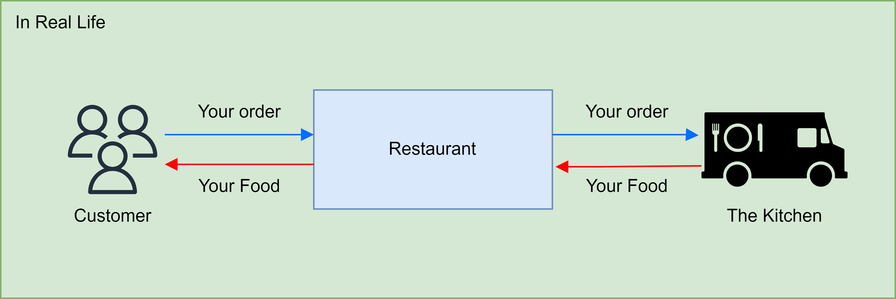
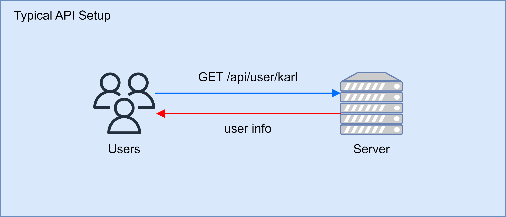
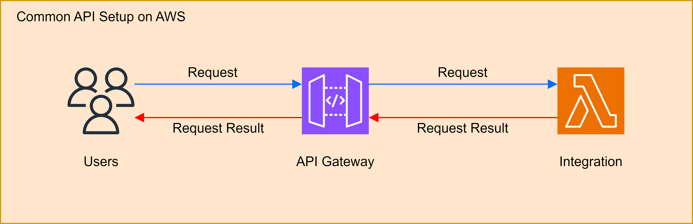

# What is API

[↩️ go back](../../README.md)

When it comes to API, there is the API in your code and there is your API that runs over the network. Not going into details, [here](https://aws.amazon.com/what-is/api/) is an article covering API from AWS. Over here we are going to talk about API over network. These include HTTP, REST, WebSocket, etc.

## Table of contents

- [What is API](#what-is-api)
  - [Table of contents](#table-of-contents)
  - [API in real life](#api-in-real-life)
    - [API in real life Example](#api-in-real-life-example)
  - [Typical API setup](#typical-api-setup)
    - [Typical API Example](#typical-api-example)
  - [Common API setup on AWS](#common-api-setup-on-aws)
    - [Common API setup Example](#common-api-setup-example)
  - [Reverse Proxy](#reverse-proxy)

## API in real life

You can think of the API as the interface between you and the kitchen in a restaurant. In the kitchen, there is a screen that tells the chefs what you ordered and you have your phone clicking the button telling the restaurant what you want to order. The things between you and the kitchen can be interpreted as an API. You give instructions to the kitchen to process your request and it returns the result, the food you ordered.

### API in real life Example

In the above example, we can see The customer placing an order.

Following the blue arrows

1. The customer place an order,  sends it to the restaurant.
2. The restaurant hands the order to the kitchen.

Following the red arrows

1. The kitchen finishes the order, hands it back to the restaurant.
2. The restaurant hands the order to the customer

In this case, the restaurant is the API. The customer is the web page you see on your browser. The kitchen is the backend server.

## Typical API setup

In most case, API setup is really simple. When an application is monolithic, there may not be a "Restaurant" in the chain.

### Typical API Example

In the above example, we can see users querying a server.

Following the blue arrows

1. The user makes a request to the server asking to get the info of the user "karl"

Following the red arrows

1. The server responds back with the user info requested.

In this case, the server can in interpreted as the API as well.

## Common API setup on AWS

Because of how elastic and dynamic AWS can be. API on AWS can be a bit more complicated than monolithic server architecture when going for [cloud native](https://aws.amazon.com/what-is/cloud-native/). But the concept is still the same, user makes a request to an API, the API resonse back with the result.

### Common API setup Example

In the above image, we can see the user making a request to an API.

Following the blue arrows

1. The user make a request to API gateway.
2. The API gateway determines where to send the request based on the integration setup
3. The request is then sent to the integration to get processed. In this case, lambda

Following the red arrows

1. After the integration, complete the request and response with the result
2. The request result is sent back to API gateway
3. The request result is sent back to the user.

## Reverse Proxy

Now that I am laying out what I know about API, API gateway is really similar to a reverse proxy.

[↩️ back to article](../../README.md)
