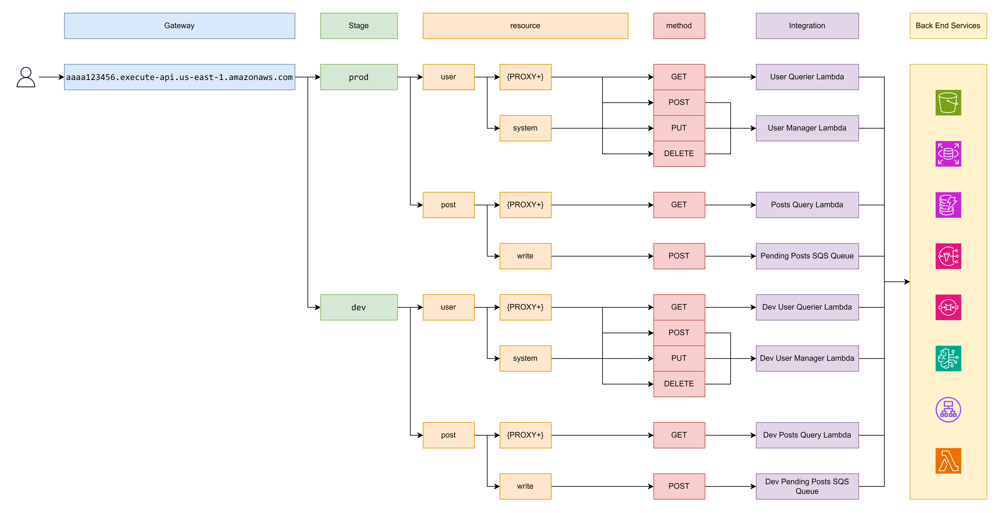
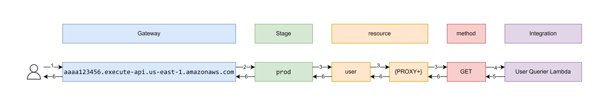

# Working With APIGW and Lambda

This page is deedicated to working with HTTP API gateway API and Lambda Function as integration to serve as a back end API.

[↩️ go back](../../README.md)

## Table of Contents

- [Working With APIGW and Lambda](#working-with-apigw-and-lambda)
  - [Table of Contents](#table-of-contents)
  - [Python Lambda Function](#python-lambda-function)
    - [Lambda Function - Handler](#lambda-function---handler)
    - [Lambda Function - Permissions](#lambda-function---permissions)
    - [Lambda Function - Debug and Logging](#lambda-function---debug-and-logging)
  - [Provisioning Lambda Function with Terraform](#provisioning-lambda-function-with-terraform)
    - [Setup lambda function](#setup-lambda-function)
    - [Setup Locals for lambda function](#setup-locals-for-lambda-function)
    - [Setup Code zip for lambda function](#setup-code-zip-for-lambda-function)
    - [Setup IAM Role for lambda function](#setup-iam-role-for-lambda-function)
    - [Setup Cloudwatch Log for lambda function](#setup-cloudwatch-log-for-lambda-function)
    - [Wrapping as a module](#wrapping-as-a-module)
  - [HTTP API Gateway](#http-api-gateway)
    - [API Gateway](#api-gateway)
    - [API Gateway - Stage](#api-gateway---stage)
    - [API Gateway - Resource](#api-gateway---resource)
    - [API Gateway - Integration](#api-gateway---integration)
    - [API Gateway - Debug and Logging](#api-gateway---debug-and-logging)
    - [API Gateway - Deployment](#api-gateway---deployment)
  - [Provisioning HTTP API Gateway with Terraform](#provisioning-http-api-gateway-with-terraform)
    - [Setup API Gateways](#setup-api-gateways)
    - [Setup API Gateway Stage](#setup-api-gateway-stage)
    - [Setup API Gateway Deployment](#setup-api-gateway-deployment)
    - [Setup API Gateway Log](#setup-api-gateway-log)
      - [Creaet Log group for API Gateway Stage](#creaet-log-group-for-api-gateway-stage)
      - [Enabling log on API Gateway Stage](#enabling-log-on-api-gateway-stage)
    - [Setup Resource](#setup-resource)
      - [Setup Reousrce - Route](#setup-reousrce---route)
      - [Setup Resource - Integration](#setup-resource---integration)
      - [Setup Resource - Integration Permission](#setup-resource---integration-permission)

## Python Lambda Function

Event triggered Lambda Function is basically. Lambda Functon Triggered by somethig. [read more](https://docs.aws.amazon.com/lambda/latest/operatorguide/event-driven-architectures.html)

In or case here, it is driven by API Gateway.

### Lambda Function - Handler

Every lambda function have what's called an `entry point`. An `entry point` is the part that get called in the lambda function when a source triggers it.


In AWS python lambda function event handler is formatted as `file name` **dot** `function name` -> `<-file name->.<-function name->`. In the above image the handler is set to `main.lambda_handler` and in the file `main.py` there is a function called `lambda_handler` that is the `entry point` for this lambda function.

[read more about handler](https://docs.aws.amazon.com/lambda/latest/dg/python-handler.html)

### Lambda Function - Permissions

Much like every other aws services a role can be attached to a lambda function. My this means, the logging to cloudwatch can be disabled by not allowing it to create log stream.


Allow Create log

```json
{
    "Version": "2012-10-17",
    "Statement": [
        {
            "Action": [
                "logs:CreateLogStream",
                "logs:PutLogEvents"
            ],
            "Effect": "Allow",
            "Resource": "arn:aws:logs:us-east-1:<-account-id->:log-group:/aws/lambda/<-function-name->:*"
        }
    ]
}
```

### Lambda Function - Debug and Logging

By default lambda function create a log streme in a cloud watch log group for each lambda function version.

Lambda function version is each time the code of a lambda function get changed and deployed.


The default log group of a lambda function is formatted as `/aws/lambda/<-function-name->`

There is no way to disable the loggin of the lambda function but the CloudWatch Log Group of where it create the log stream and it's format can be changed.


Every output on to the terminal when running the python code is logged in the log stream plus the start and end of the lambda function.


## Provisioning Lambda Function with Terraform

This setup assumes following directory tree

```tree
.
├── code
│   └── demo
│       ├── helper.py
│       └── main.py
├── main.tf
├── output.tf
└── variables.tf
```

The setup here may look insain and disconnected, but it will make sense in the end.

### Setup lambda function

```hcl
/*########################################################
Lambda Function

######################################################## */
resource "aws_lambda_function" "this" {
  // User Input Lambda Function
  function_name = local.lambda-function-name
  description   = var.description

  filename         = var.source_code_zip_path
  source_code_hash = filebase64sha256(var.source_code_zip_path)

  handler       = local.lambda-handler
  runtime       = local.lambda-runtime
  architectures = [local.lambda-architecture]

  role = local.lambda-execution-role-arn

  timeout = local.lambda-timeout

  environment {
    variables = var.additional-environment-variables
  }
}
```

References:

- [https://registry.terraform.io/providers/hashicorp/aws/latest/docs/resources/lambda_function](https://registry.terraform.io/providers/hashicorp/aws/latest/docs/resources/lambda_function)

---

### Setup Locals for lambda function

```hcl
locals {
  prefix = lower(replace(replace(var.prefix, " ", "-"), "_", "-"))

  lambda-function-name = "${local.prefix}-${var.name}"

  lambda-handler      = lookup(var.lambda-config, "handler", "lambda_function.lambda_handler")
  lambda-runtime      = lookup(var.lambda-config, "runtime", "python3.12")
  lambda-architecture = lookup(var.lambda-config, "architecture", "arm64")
  lambda-timeout      = lookup(var.lambda-config, "timeout", 300)

  lambda-create_role        = lookup(var.lambda-config, "execution_role", null) == null ? true : false
  lambda-execution-role-arn = local.lambda-create_role == true ? aws_iam_role.this[0].arn : var.lambda-config.execution_role

  cloudwatch-log-group-name = "/aws/lambda/${local.lambda-function-name}"
}

data "aws_caller_identity" "current" {}
```

### Setup Code zip for lambda function

```hcl
/*########################################################
User Input Lambda Module

########################################################*/
data "archive_file" "lambda_function-demo" {
  // Zip file of the lambda function code
  type        = "zip"
  source_dir  = "${path.module}/code/demo"
  output_path = "${path.module}/code/demo.zip"
}
```

References:

- [https://registry.terraform.io/providers/hashicorp/archive/latest/docs/data-sources/file](https://registry.terraform.io/providers/hashicorp/archive/latest/docs/data-sources/file)

---

### Setup IAM Role for lambda function

```hcl
/*########################################################
Lambda Function Base Permissions

########################################################*/
resource "aws_iam_role" "this" {
  count = local.lambda-create_role == true ? 1 : 0
  name  = lower("${local.lambda-function-name}-role")
  assume_role_policy = jsonencode({
    Version = "2012-10-17"
    Statement = [{
      Effect = "Allow",
      Principal = {
        Service = "lambda.amazonaws.com"
      },
      Action = "sts:AssumeRole"
    }]
  })

  inline_policy {
    name = "cloudwatch-logs"
    policy = jsonencode({
      Version = "2012-10-17"
      Statement = [{
        Effect   = "Allow",
        Action   = ["logs:CreateLogStream", "logs:PutLogEvents"],
        Resource = "arn:aws:logs:${var.aws-region}:${data.aws_caller_identity.current.account_id}:log-group:${local.cloudwatch-log-group-name}:*"
      }]
    })
  }

  dynamic "inline_policy" {
    for_each = var.additional-permissions
    content {
      name   = inline_policy.value.name
      policy = jsonencode(inline_policy.value.policy)
    }
  }
}
```

References:

- [https://registry.terraform.io/providers/hashicorp/aws/latest/docs/resources/iam_role](https://registry.terraform.io/providers/hashicorp/aws/latest/docs/resources/iam_role)

---

### Setup Cloudwatch Log for lambda function

```hcl
/*########################################################
Lambda Function CloudWatch Logs

########################################################*/
resource "aws_cloudwatch_log_group" "this" {
  count             = var.create-cloudwatch-log-group == true ? 1 : 0
  name              = local.cloudwatch-log-group-name
  retention_in_days = 7
}
```

References:

- [https://registry.terraform.io/providers/hashicorp/aws/latest/docs/resources/cloudwatch_log_group](https://registry.terraform.io/providers/hashicorp/aws/latest/docs/resources/cloudwatch_log_group)

---

### Wrapping as a module

From the looks of the above. All of this looks insain and it probably is. There is a lot of repeated things and lot of resources that wont be used.

At some point down the line. I created a [module](https://developer.hashicorp.com/terraform/language/modules) that included all the basic settings for a lambda function and got rid of 90% of repeat code in the project.

[https://github.com/ltekme/ltekme/tree/main/Snippets-and-Templates/AWS/Lambda-Function-Module](https://github.com/ltekme/ltekme/tree/main/Snippets-and-Templates/AWS/Lambda-Function-Module)

AWS has a lambda module ready to be used, but that is too complicated in my opeanion,

Now from that pheasco to just this

```hcl
data "archive_file" "lambda_function-user_request" {
  // Zip file of the lambda function
  type        = "zip"
  source_dir  = "${path.module}/code/user_request"
  output_path = "${path.module}/code/user_request.zip"
}

module "lambda_function-user_request" {
  // Lambda Function Defination
  source = "./modules/lambda"

  aws-region  = var.aws-region
  prefix      = var.project-name
  name        = "user-request"
  description = "validate user input"

  source_code_zip_path = data.archive_file.lambda_function-user_request.output_path

  lambda-config = {
    handler        = "main.lambda_handler"
    runtime        = "python3.12"
    architecture   = "arm64"
    timeout        = 10
    execution_role = var.lambda_function-user_request-execution_role
  }

  additional-permissions = [
    {
      name = "sqs-permission"
      policy = {
        Version = "2012-10-17"
        Statement = [
          {
            Effect   = "Allow",
            Action   = ["sqs:SendMessage"],
            Resource = ["${aws_sqs_queue.user_request.arn}"]
          }
        ]
      }
    }
  ]

  additional-environment-variables = {
    "SQS_QUEUE_URL" = "${aws_sqs_queue.user_request.url}"
  }
}
```

This may not offers a lot customization but jsut enough for a native python based lambda function.

## HTTP API Gateway

Since we have this lambda function. We need a way to execute it. [HTTP API Gateway](https://docs.aws.amazon.com/apigateway/latest/developerguide/http-api.html) is one of the service that allow you to connect your lambda function to the internet.

An apigw url may look like this

```text
https://aaaa123456.execute-api.us-east-1.amazonaws.com/prod/user
https://aaaa123456.execute-api.us-east-1.amazonaws.com/prod/user/karl
```



and it is divided to the following part

- [Gateway](#api-gateway)
- [Stage](#api-gateway---stage)
- [Resource](#api-gateway---resource)
- [Integration](#api-gateway---integration)

and

- [Deployment](#api-gateway---deployment)

---

### API Gateway

The first part of the url. It is the entry point of the API, it can called the root of the API.

[https://docs.aws.amazon.com/apigateway/latest/developerguide/http-api.html](https://docs.aws.amazon.com/apigateway/latest/developerguide/http-api.html)

There is mothing much to it. Just the entry url for the api.

---

### API Gateway - Stage

Next is the stage, the second section of an execution url. This is a bit more complicated. It looks like a way to divide up to mutable service going into the same api gateway as a means to divide up resources. But that goes againse aws docs according to some docs. At the end, the best explination I could find about it is ops, dev stage, testing stage, prod stage.

[https://stackoverflow.com/questions/47848586/what-is-a-stage-in-the-context-of-amazon-api-gateway](https://stackoverflow.com/questions/47848586/what-is-a-stage-in-the-context-of-amazon-api-gateway)

But here in the project, it is just there.

---

### API Gateway - Resource

Resources are path to the integration. In the above example, if we make a `GET` request to the path `https://aaaa123456.execute-api.us-east-1.amazonaws.com/prod/user/karl`. Here is how things would go.



1. The request gets to the gateway

   Stripped out the `gateway` in the url and left with `prod/user/karl`

2. The request gets routed to the corosponging `Stage` based on the path

   strip out the `stage` from the url and left with `user/karl`

3. The request gets routed in the `resources` based on the path

   In this case, seeing what's left from `step 2`, we match the first part of the path. `user`. In this reource there is a sub resource called `{PROXY+}` matching the second path of the path `karl`

   Now match the HTTP method. In out case `GET` wich get sent to the corrosponding client method defined integration.

4. The request is send to the `integration` with a bunch of information about the request.

   [https://docs.aws.amazon.com/apigateway/latest/developerguide/http-api-develop-integrations-lambda.html](https://docs.aws.amazon.com/apigateway/latest/developerguide/http-api-develop-integrations-lambda.html).

   When the request is sent to the lambda function. It is sent to the `event` argument in the handler. For the full guide, RTFM or spend 10 hours expermenting every little details.

5. After the request is processed, API Gateway expect a dict containing the `statusCode`, `headers`(optional), `body`. like below

   ```py
   {
     "isBase64Encoded": False,
     "statusCode": 200,
     "body": json.dumps({ "message": "Hello from Lambda!" }),
     "headers": {
       "content-type": "application/json"
     }
   }
   ```

   or change the content type to other things like html, xml, text. The `body` is what returned to the client and the `statusCode` is responded in the HTTP headers.

6. The response gets repackaged by API gateway and sent back to the client.

This is just a very dumbed downed version of what API gateway is, a very high level explination of what's going on. Below is the link to get started with.

[https://docs.aws.amazon.com/lambda/latest/dg/services-apigateway.html](https://docs.aws.amazon.com/lambda/latest/dg/services-apigateway.html)

### API Gateway - Integration

Here, the integration is the part that gets executed when a request made matched it. Just like the above example.

In the above example, it is integrated with a lambda function, but API gateway can be integrated with lots of other aws serveices, like SQS, EventBridge, Custom url, Private resourece in vpc, and much more.

### API Gateway - Debug and Logging

Sometimes when something goes wrong due to configuration errors or integration errors, API Gateway will respond with `500 - {"message":"Internal Server Error"}`.

Sometimes it's raised by the integration. In the image below, in the lambda code is instructed to crash the function, but the same goes to actule errors as well.


Sometimes it due to permissions


Or sometimes API Gateway will respond with `404 - {"message":"Not Found"}` when the integration is not found.

It's annoying, but logging can help.


### API Gateway - Deployment

You can think of deployment as the final button to production. When auto deployment is not enabled, any resource changes to the api is not in production. Once it is deployed, the modified resources will be deployed to the stage.

## Provisioning HTTP API Gateway with Terraform

### Setup API Gateways

```hcl
resource "aws_apigatewayv2_api" "main" {
  name          = "${var.project-name}-API"
  protocol_type = "HTTP"

  cors_configuration {
    allow_origins = ["*"]
    allow_methods = ["POST", "GET", "OPTIONS", "DELETE"]
    allow_headers = ["content-type"]
    max_age       = 300
  }
}
```

References:

- [https://registry.terraform.io/providers/hashicorp/aws/latest/docs/resources/apigatewayv2_api](https://registry.terraform.io/providers/hashicorp/aws/latest/docs/resources/apigatewayv2_api)

### Setup API Gateway Stage

```hcl
resource "aws_apigatewayv2_stage" "main" {
  api_id      = aws_apigatewayv2_api.main.id
  name        = replace(replace("${var.project-name}_API_Stage", " ", "_"), "-", "_")
  auto_deploy = true
}
```

for the log format and contents see, [https://docs.aws.amazon.com/apigateway/latest/developerguide/http-api-logging-variables.html](https://docs.aws.amazon.com/apigateway/latest/developerguide/http-api-logging-variables.html)

References:

- [https://registry.terraform.io/providers/hashicorp/aws/latest/docs/resources/apigatewayv2_stage](https://registry.terraform.io/providers/hashicorp/aws/latest/docs/resources/apigatewayv2_stage)

### Setup API Gateway Deployment

```hcl
resource "aws_apigatewayv2_deployment" "main" {
  api_id      = aws_apigatewayv2_api.main.id
  description = "${var.project-name}-API-Deployment"

  lifecycle {
    create_before_destroy = true
  }

  depends_on = [
    aws_apigatewayv2_route.submit_post
  ]
}
```

References:

- [https://registry.terraform.io/providers/hashicorp/aws/latest/docs/resources/apigatewayv2_deployment](https://registry.terraform.io/providers/hashicorp/aws/latest/docs/resources/apigatewayv2_deployment)

### Setup API Gateway Log

#### Creaet Log group for API Gateway Stage

```hcl
resource "aws_cloudwatch_log_group" "main-api_gateway" {
  name              = "/aws/apigateway/${aws_apigatewayv2_api.main.id}"
  retention_in_days = 7
}
```

References:

- [https://registry.terraform.io/providers/hashicorp/aws/latest/docs/resources/cloudwatch_log_group](https://registry.terraform.io/providers/hashicorp/aws/latest/docs/resources/cloudwatch_log_group)

#### Enabling log on API Gateway Stage

```hcl
resource "aws_apigatewayv2_stage" "main" {
  api_id      = aws_apigatewayv2_api.main.id
  name        = replace(replace("${var.project-name}_API_Stage", " ", "_"), "-", "_")

  access_log_settings {
    destination_arn = aws_cloudwatch_log_group.main-api_gateway.arn
    format = jsonencode({
      requestId               = "$context.requestId",
      ip                      = "$context.identity.sourceIp",
      requestTime             = "$context.requestTime",
      httpMethod              = "$context.httpMethod",
      status                  = "$context.status",
      protocol                = "$context.protocol",
      integrationErrorMessage = "$context.integrationErrorMessage",
      errorMessage            = "$context.error.message"
    })
  }
}
```

### Setup Resource

#### Setup Reousrce - Route

```hcl
resource "aws_apigatewayv2_route" "submit_post" {
  api_id    = aws_apigatewayv2_api.main.id
  route_key = "POST /api/submit_post"
  target    = "integrations/${aws_apigatewayv2_integration.submit_post.id}"
}
```

#### Setup Resource - Integration

```hcl
resource "aws_apigatewayv2_integration" "submit_post" {
  api_id               = aws_apigatewayv2_api.main.id
  passthrough_behavior = "WHEN_NO_MATCH"
  integration_type     = "AWS_PROXY"
  integration_method   = "POST"
  integration_uri      = module.lambda_function-user_request.lambda_function.invoke_arn
}
```

#### Setup Resource - Integration Permission

```hcl
resource "aws_lambda_permission" "submit_post" {
  statement_id  = "AllowExecutionFromAPIGateway"
  action        = "lambda:InvokeFunction"
  function_name = module.lambda_function-user_request.lambda_function.arn
  principal     = "apigateway.amazonaws.com"
  source_arn    = "${aws_apigatewayv2_api.main.execution_arn}/*/*/*"
}
```

References:

- [https://registry.terraform.io/providers/hashicorp/aws/latest/docs/resources/apigatewayv2_route](https://registry.terraform.io/providers/hashicorp/aws/latest/docs/resources/apigatewayv2_route)
- [https://registry.terraform.io/providers/hashicorp/aws/latest/docs/resources/apigatewayv2_integration](https://registry.terraform.io/providers/hashicorp/aws/latest/docs/resources/apigatewayv2_integration)
- [https://registry.terraform.io/providers/hashicorp/aws/latest/docs/resources/lambda_permission](https://registry.terraform.io/providers/hashicorp/aws/latest/docs/resources/lambda_permission)
