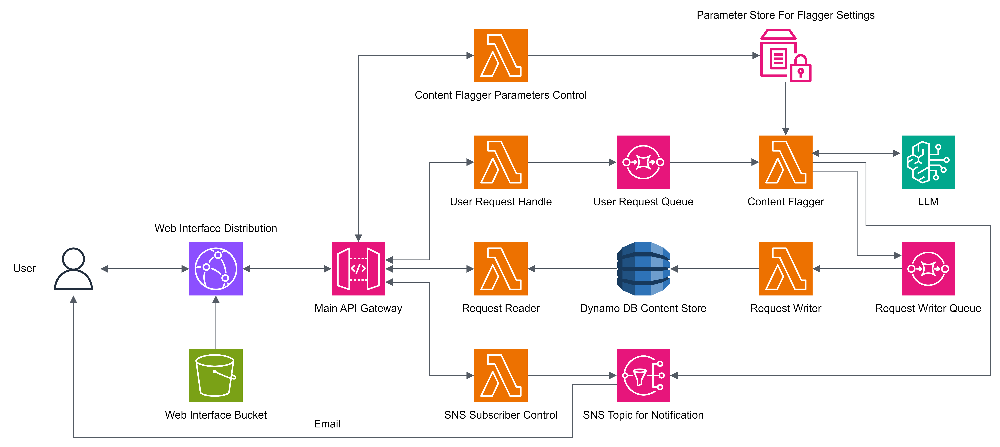

# Exploring Lambda, APIGW, SQS, SNS and ReactJS

This is a post about playing with sqs, sns, apigw, lambda, react. The starter pack for any small project that involve cloud.

[↩️ go back](../)

## background

When I was studying for the AWS-SAA exam I came across [`decoupling`](https://docs.aws.amazon.com/prescriptive-guidance/latest/modernization-integrating-microservices/decouple-messaging.html) a lot.

From a monolith ec2 instance to s3 for static content and lambda function to handle requests. If a lambda function handles too many tasks or takes too long to complete or may not be able to complete, we decouple it with SQS. I know why and when to use SQS, but in practice, how does it actually work? I've wanted to play with it for a while now, but I haven't been able to find a use case for myself.

### The problem

Last month, one of my friends from high school dragged me to chat with his friends to talk about an idea his classmate had. The project is an online platform that allows its users to post something, someone's response and something something, not going into details, but one of the problems we encountered is platform moderation. We want to allow users to post content(mostly text) freely, and we also want to not monitor the platform 24/7.

That's when I had an idea to use AI to screen the content before it is published. The idea is to have an LLM look at the content submitted and mark it as safe and not safe based on a set of rules, if a submission is flagged the site will send an email to moderators to manually verify the content.

### What happened

The idea is great and the project lead thinks it's great as well. The only problem is that the 2 people leading the project didn't prepare anything and probably didn't know what they were doing. When we pointed out a list of concerns and problems that didn't cross their mind, the project was scrapped in the end.

But the idea of a content screener is not dead and I now have an excuse to use sqs, sns, apigw, and lambda functions to solve a problem that doesn't exist. So here is what I have gone through and learned from building something like this.

## Design

Github repo: [ltekme/AI-Screener-For-User-Generated-Content](https://github.com/ltekme/AI-Screener-For-User-Generated-Content)

This is an illustration of how it is hosted on AWS. Because I wanted to make it work on both a normal account and AWS Acaedmy Learn Lab account, this diagram is different from the one hosted on AWS Acaedemy Learner Lab.

Some of the things are not included when deploying on Learner Lab, namely Bedrock, and CloudFront. I can understand bedrock, but CloudFront as well??? I can spend another couple of days migrating the AI part to Google Vertex AI so it can still flag content, but I figured, no.

## S3 + ReactJS is great

### What is ReactJS

[ReactJS](https://react.dev/) is a javascript library for building user interfaces developed by Facebook and is widely used by developers to create dynamic web interfaces. To learn more, checkout: [https://react.dev/learn](https://react.dev/learn)

### React offerings

React offers both `server-side rendering` and `client-side rendering`. In short `server-side rendering` is when the server constructs the HTML and sends it to the client browser to render the page.

`client-side rendering` is the opposite of `server-side rendering`. It renders the web page after it has arrived at the browser. The browser executes reactjs. Reactjs adds and changes elements on the client to render the page. The page rendering process is now done on the client instead of the server.

Read more: [React.js: Server-Side Rendering vs Client-Side Rendering](https://flatirons.com/blog/react-js-server-side-rendering-vs-client-side-rendering/#:~:text=Key%20Takeaways%3A-,React.,using%20JavaScript%20for%20dynamic%20updates.)

Its flexibility allows developers to quickly spinup an idea without too much hassle. Not to mention its brothers like [vuejs](https://vuejs.org/), and [nextjs](https://nextjs.org/). Almost anything that comes to mind on a browser window can be built using it. It is just JavaScript. Being popular among developers, it is widely adopted by hosting providers like [Vercel](https://vercel.com/). It can even be run on [GitHub pages](https://pages.github.com/). Both of which is free* to a certain extent.

### S3 is perfect

With the above, reactjs only needs the clients to do the rendering, we only need to serve the HTML to the browser. It is screaming "Host it on s3".

To put it simply. S3 is a hard disk plugged into the internet, allowing users to store and access their data as long as there is an internet connection. One of its features is [static website hosting](https://docs.aws.amazon.com/AmazonS3/latest/userguide/WebsiteHosting.html). I made a post on how you can use s3 and CloudFront to host your website globally for almost free* [here](../1.Using-S3-to-host-static-website/README.md).

## Cloufront is not just a CDN

Even though [CloudFront](https://aws.amazon.com/cloudfront/) on paper sounds like CDN, like Amazon, it is way more then just a CDN.

### Content Delivery Network

CDN is basically copies of the same thing hosted by lots of smaller servers placed around the world. So you don't need to query a server in the US from HK, instead, you are accessing a copy of the same content cache nearest you. Read more: [https://aws.amazon.com/what-is/cdn/](https://aws.amazon.com/what-is/cdn/), [https://en.wikipedia.org/wiki/Content_delivery_network](https://en.wikipedia.org/wiki/Content_delivery_network)

### CloudFront as router

Just like some of other AWS global services, Cloudfrot can be used as a web router. In this case routing requests from one place to another.

I have been searching for this for far too long. One of the things I want to do is `/api` on a website without going to a different domain. It is just recently I found out how it's done on CloudFront. Before, I would have another domain prefix(api.example.com) to serve [API Gateway](https://aws.amazon.com/api-gateway/).

### CloudFront as HTTP rewrite

One of the features of CloudFront is [custom error response](https://docs.aws.amazon.com/AmazonCloudFront/latest/DeveloperGuide/custom-error-pages-procedure.html).

In the above, using s3 to host reactjs has its perks, most noticeably 404/403 response. Because reactjs only runs with 1 HTML file and the path is consumed and processed by reactjs on the client, the client browser will query the server for a path that may not exist in the s3 bucket. In s3 you can serve the same HTML for [error document](https://docs.aws.amazon.com/AmazonS3/latest/userguide/CustomErrorDocSupport.html#custom-error-document), but there is no change on the status code, 404 will be 404.

We can get around that by using CloudFront's custom error response. We just need to rewrite 4xx error codes to 200 and serve the index.html, and every path will return 200. Note reactjs can work even with 404 and 403 responses. The issue is different browsers react to these status codes differently, some may not show the error document at all. By rewriting to 200, we can guaranty the browser will take the non-existent path as well.

### How it's implemented

Because it is too long to put everything in one README, the implementation is on a different page [here: pages/Using-CloudFront-and-S3-to-host-ReactJS/RADME.md](pages/Using-CloudFront-and-S3-to-host-ReactJS/RADME.md)
